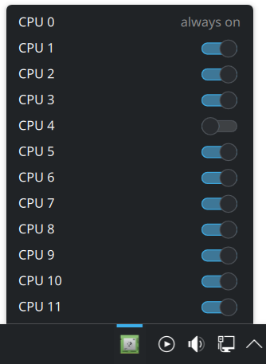

# Koretoggle
> 🚨🚨🚨 AI SLOP 🚨🚨🚨  
> This repo was entirely made with Claude

A KDE Plasma 6 panel widget for enabling and disabling individual CPU cores at runtime, inspired by Haiku's [ProcessController](https://www.haiku-os.org/docs/userguide/en/desktop-applets/processcontroller.html).



## Requirements
- KDE Plasma 6
- `plasma5support` package (provides the executable DataSource compatibility layer)
- `polkit` (for privilege escalation)

## Installation
Koretoggle has two parts: a privileged helper that must be installed system-wide, and the plasmoid itself.

### 1. Install the helper
Clone this repository and run the install script:

```bash
git clone https://github.com/yourusername/koretoggle.git
cd koretoggle
chmod +x install.sh
sudo ./install.sh
```

### 2. Install the plasmoid
**Manually:**

```bash
kpackagetool6 --install . --type Plasma/Applet
```

Or install from the `.plasmoid` file:

```bash
kpackagetool6 --install org.koretoggle.plasmoid --type Plasma/Applet
```

Then right-click your panel → *Add Widgets* → search for *Koretoggle*.

## Usage
Click the widget icon in the panel to open the popup. Each CPU core is listed with a toggle switch. CPU 0 is always-on and cannot be disabled. The first toggle per session requires authentication; subsequent toggles within ~5 minutes proceed silently.

## Uninstall
```bash
sudo ./uninstall.sh
kpackagetool6 --remove org.koretoggle.plasmoid --type Plasma/Applet
```

## License
GPL-2.0-or-later — see [LICENSE](LICENSE).
